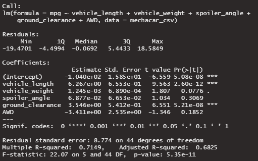
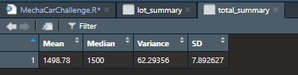
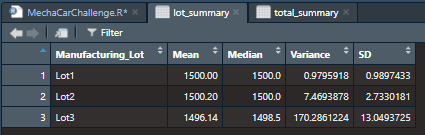

# MechaCar_Statistical_Analysis - Module 15 - R and Stats

## Overview of Analysis

The purpose of this project is to complete a series of statistical analysis for the analysis of a MechaCar process. The four tasks will be completed using R.

## Resources Used

- Software: RStudio 2022.02.1 Build 461

## Analysis and Results

The four tasks to be completed are as follows:

- Linear Regression to Predict MPG
- Summary Statistics on Suspension Coils
- T-Test on Suspension Coils
- Designing a Study Comparing the MechaCar to the Competition

## Linear Regression to Predict MPG

Based on the results shown:
- The variables of vehicle_length and ground_clearance have the the most significance to the mpg values
- Based on the p-value of 5.35e-11, less then an assumed significance of 0.05, the slope can be assumed to not be zero
- Based on the Multiple R-squared value of 0.7149, a decent amount of the mpg performance can be estimated by the model, but the high significance of the intercept may indicate transformations or other variables may need to be researched.

## Summary Statistics on Suspension Coils

The total summary of all lots combined is as shown below:

The summary by lot is as shown below:

Based on the total summary, the variance in coils produced is about 62 PSI, and falls withing the acceptable manufacturing standards.

However, as shown by the breakdown by lot, the suspension coils produced by Lot3 show a variance of 170, greater then the allowable variance of 100. Lot1 and Lot2 have variances of 0.97 and 7.46 respectively, and fall within standards.

## T-Tests on Suspension Coils

Four t-tests were performed comparing the means of the production of all lots combined and each lot individually to the population mean of 1500. The results are shown below:

#### T-test Total

#### T-test for Lot 1

#### T-test for Lot 2

#### T-test for Lot 3

Based on this analysis the Total Summary of all Lots as well as the T-test for Lots 1 and 2 have p-values greater then 0.05, which means they fail to reject the null hypothesis, which mean the means of each set are not significantly different then 1500.

The p-value for Lot 3 was 0.04, less then the assumed significance of 0.05. Therefore, we reject the null hypothesis, meaning for this two-tailed t-test, the average PSI produced by Lot 3 is significantly different then  the population mean of 1500.

## Study Design: MechaCar vs Competition

One option of a statistical test that can be taken is finding a particular aspect of MechaCar's design that would stand above the industry average of the competition. As an example, if the fuel economy was a focus of the design of the Mecha Car, a one-tailed t-test could be performed as such:

- The metric used for analysis is the fuel economy, or MPG
- The null hypothesis would be that the industry average fuel economy is equal or not significantly less then the performance of the MechaCar
- The alternative hypothesis would be that the industry average is significantly less the the performance of the MechaCar, which can be shown as a step above and beyond what the industry is doing.

As mentioned, this would be a one-tailed t-test. While a two-tailed t-test could also be used, we would want to prove that the fixed value of MechaCar's performance is better then the performance of the competition, while a two-tailed test would succeed even if MechaCar's performance was significantly worse.

The data required for this test would be collecting data on manufacturer performance of various models of competing cars. Depending on the focus of the analysis, this could be a larger pool of vehicles of different types or only specific models that might share other features like size or seating.